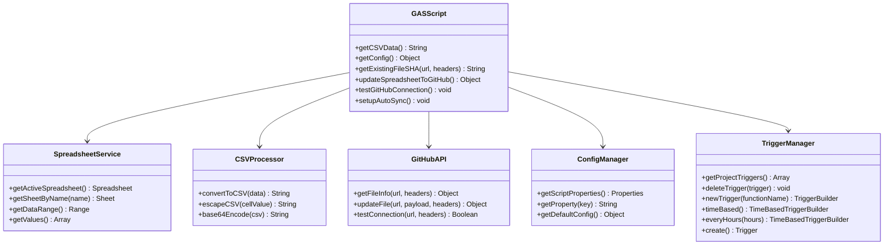
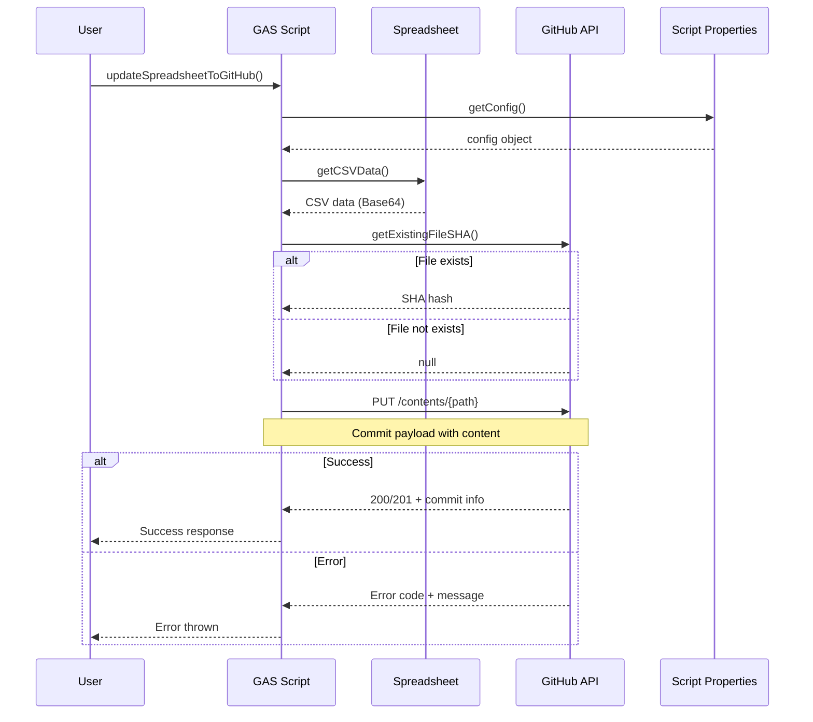
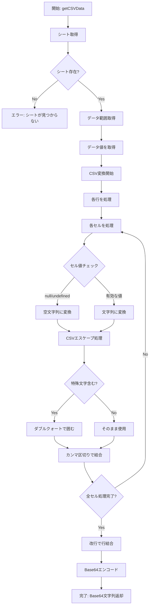
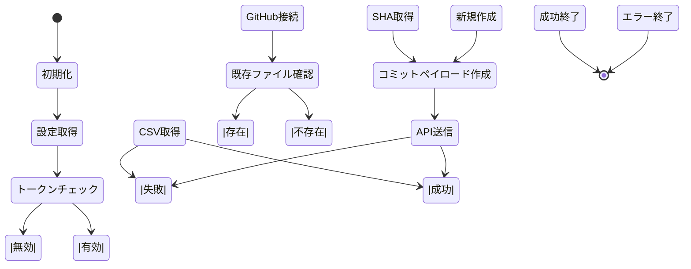
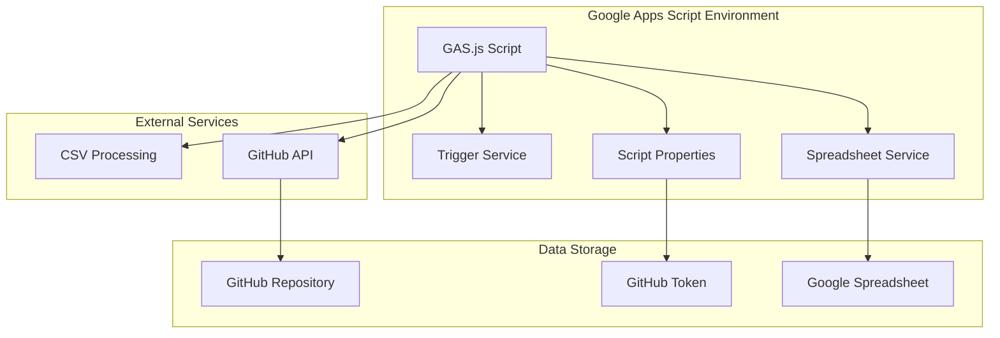

# GAS.js ファイル分析とUML図

## 概要

このドキュメントは、Google Apps Script (GAS) でスプレッドシートとGitHubリポジトリを同期する `GAS.js` ファイルの分析結果と、必要なUML図をまとめたものです。

## ファイル分析

### 主要機能
- スプレッドシートからCSVデータを取得
- CSVデータをBase64エンコード
- GitHub APIを使用してリポジトリにコミット
- 自動同期のためのトリガー設定

### 関数一覧
1. `getCSVData()` - CSVデータ取得・変換
2. `getConfig()` - 設定情報取得
3. `getExistingFileSHA()` - 既存ファイルSHA取得
4. `updateSpreadsheetToGitHub()` - メイン同期処理
5. `testGitHubConnection()` - 接続テスト
6. `setupAutoSync()` - 自動同期設定

## UML図

### 1. クラス図

### 2. シーケンス図（メイン同期処理）

### 3. アクティビティ図（CSVデータ処理）

### 4. 状態図（GitHub同期処理）

### 5. コンポーネント図

## データフロー

### 入力データ
- Google Spreadsheet のシートデータ
- スクリプトプロパティ（GitHub Token、コミッター情報）

### 処理フロー
1. **データ抽出**: Spreadsheet → CSV形式
2. **データ変換**: CSV → Base64エンコード
3. **API通信**: GitHub Contents API
4. **結果保存**: コミット情報の記録

### 出力データ
- GitHubリポジトリのCSVファイル
- コミット履歴
- 実行ログ

## 設定項目

### 必須設定
- `GITHUB_TOKEN`: GitHub Personal Access Token
- `owner`: GitHubユーザー名
- `repo`: リポジトリ名
- `path`: ファイルパス

### オプション設定
- `COMMITTER_NAME`: コミッター名
- `COMMITTER_EMAIL`: コミッターメール

## エラーハンドリング

### 主要エラーケース
1. シートが見つからない
2. GitHubトークンが設定されていない
3. GitHub API通信エラー
4. ファイル更新失敗

### エラー対応
- 適切なエラーメッセージの表示
- ログ出力
- 例外の再スロー

## セキュリティ考慮事項

### 認証
- GitHub Personal Access Token の使用
- スクリプトプロパティでの機密情報管理

### アクセス制御
- リポジトリへの書き込み権限
- トークンの有効期限管理

## パフォーマンス最適化

### 実行頻度
- デフォルト: 1時間ごと
- カスタマイズ可能

### データ処理
- 効率的なCSV変換
- Base64エンコードの最適化

## 拡張性

### 追加可能な機能
- 複数シート対応
- 差分更新
- バックアップ機能
- 通知機能

### カスタマイズポイント
- 同期頻度
- ファイル形式
- コミットメッセージ
- エラー通知
