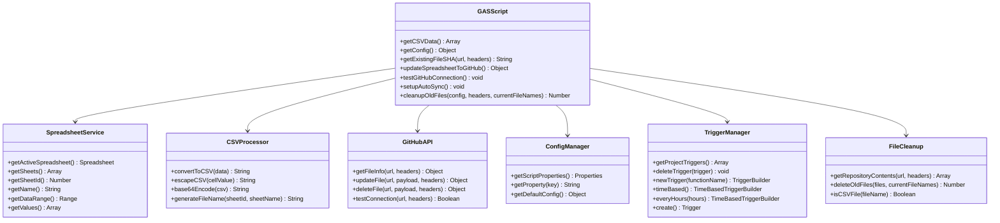
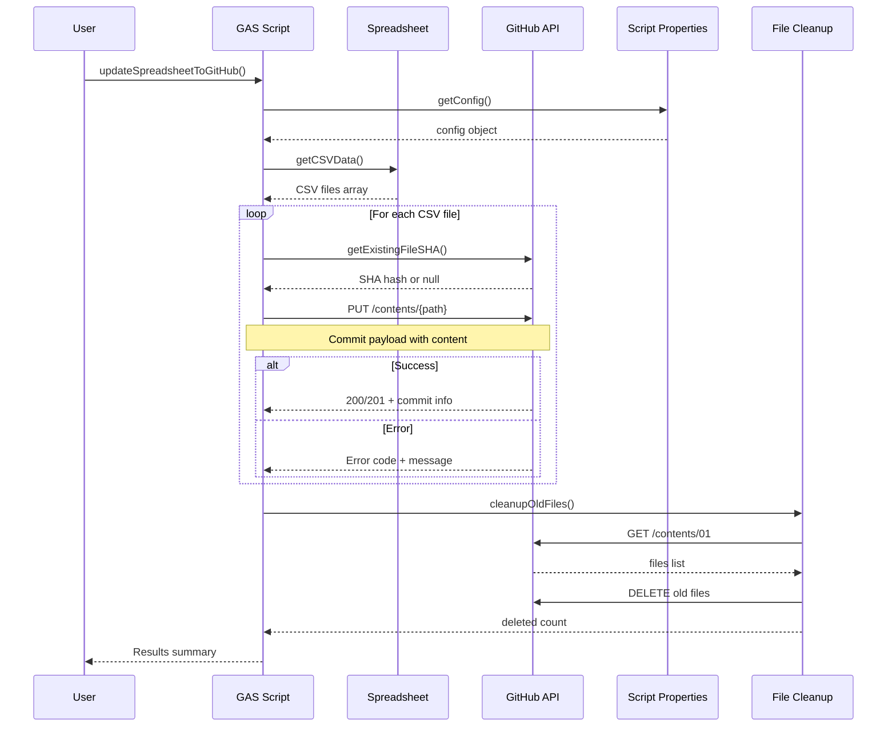
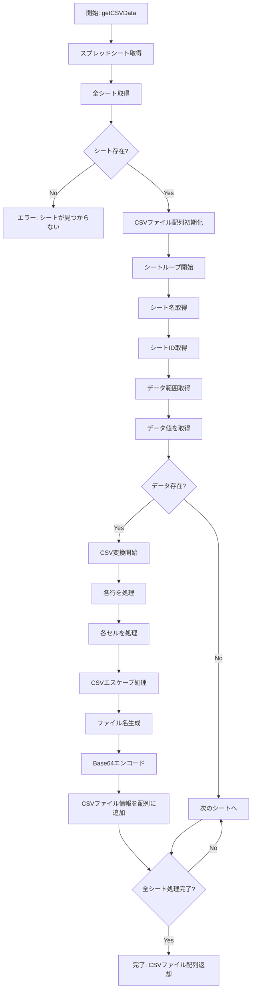
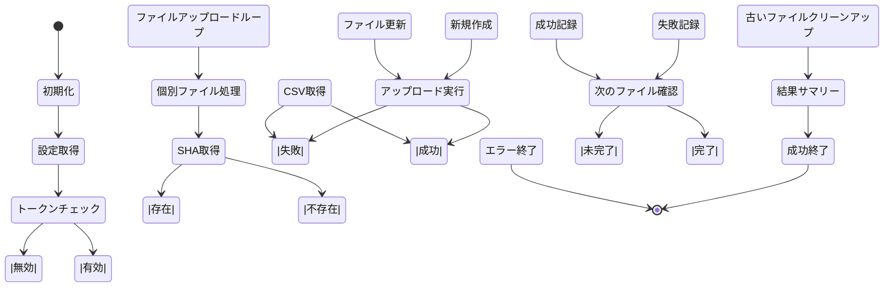
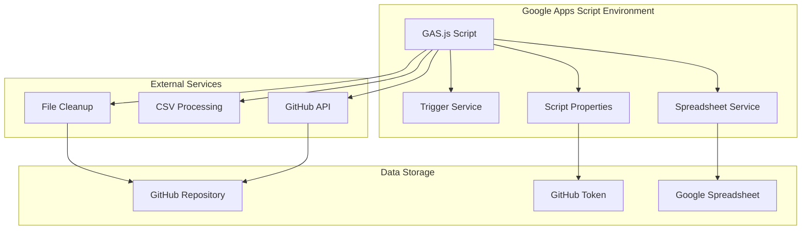

# GAS.js ファイル分析とUML図

## 概要

このドキュメントは、Google Apps Script (GAS) でスプレッドシートとGitHubリポジトリを同期する `GAS.js` ファイルの分析結果と、必要なUML図をまとめたものです。

## ファイル分析

### 主要機能
- スプレッドシートからCSVデータを取得
- CSVデータをBase64エンコード
- GitHub APIを使用してリポジトリにコミット
- 自動同期のためのトリガー設定

### 関数一覧
1. `getCSVData()` - CSVデータ取得・変換
2. `getConfig()` - 設定情報取得
3. `getExistingFileSHA()` - 既存ファイルSHA取得
4. `updateSpreadsheetToGitHub()` - メイン同期処理
5. `testGitHubConnection()` - 接続テスト
6. `setupAutoSync()` - 自動同期設定
7. `cleanupOldFiles()` - 古いファイルのクリーンアップ

## UML図

### 1. クラス図

### 2. シーケンス図（メイン同期処理）

### 3. アクティビティ図（CSVデータ処理）

### 4. 状態図（GitHub同期処理）

### 5. コンポーネント図

## データフロー

### 入力データ
- Google Spreadsheet の全シートデータ
- スクリプトプロパティ（GitHub Token、コミッター情報）

### 処理フロー
1. **データ抽出**: 各シート → 個別CSV形式
2. **ファイル名生成**: シートID + シート名
3. **データ変換**: CSV → Base64エンコード
4. **API通信**: GitHub Contents API（個別ファイル）
5. **クリーンアップ**: 古いファイルの自動削除
6. **結果記録**: 各ファイルの処理結果を記録

### 出力データ
- GitHubリポジトリの01フォルダ内のCSVファイル群
- コミット履歴
- 実行ログ
- 処理結果サマリー

## 設定項目

### 必須設定
- `GITHUB_TOKEN`: GitHub Personal Access Token
- `owner`: GitHubユーザー名（コード内で設定）
- `repo`: リポジトリ名（コード内で設定）
- `path`: 出力フォルダ（01/）

### オプション設定
- `COMMITTER_NAME`: コミッター名
- `COMMITTER_EMAIL`: コミッターメール

## エラーハンドリング

### 主要エラーケース
1. シートが見つからない
2. GitHubトークンが設定されていない
3. GitHub API通信エラー
4. 個別ファイルのアップロード失敗
5. 古いファイルの削除失敗

### エラー対応
- 個別ファイルの処理失敗時も他のファイルは継続処理
- 適切なエラーメッセージの表示
- ログ出力とエラー記録
- 結果サマリーでの成功/失敗件数の報告

## セキュリティ考慮事項

### 認証
- GitHub Personal Access Token の使用
- スクリプトプロパティでの機密情報管理

### アクセス制御
- リポジトリへの書き込み権限
- トークンの有効期限管理
- ファイル削除時の権限確認

## パフォーマンス最適化

### 実行頻度
- デフォルト: 1時間ごと
- カスタマイズ可能（分、時間、日単位）

### データ処理
- 効率的なCSV変換
- Base64エンコードの最適化
- 個別ファイル処理による並列性

## 拡張性

### 追加可能な機能
- 複数フォルダへの出力
- 差分更新の最適化
- バックアップ機能
- 通知機能（Slack、メール等）
- データ検証機能

### カスタマイズポイント
- 同期頻度
- 出力フォルダ構造
- コミットメッセージ形式
- エラー通知方法
- ファイル命名規則

## 保守性

### コード品質
- 関数の単一責任原則
- エラーハンドリングの統一
- ログ出力の標準化
- 設定の外部化

### テスト可能性
- 個別関数の単体テスト
- モック化可能な設計
- エラーケースの網羅
- ログ出力の検証
