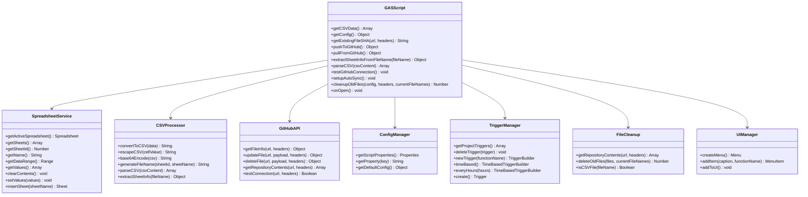
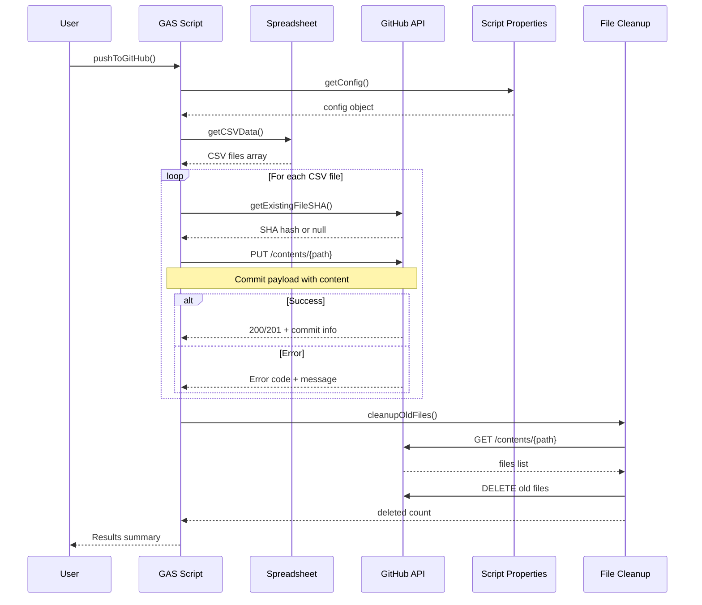
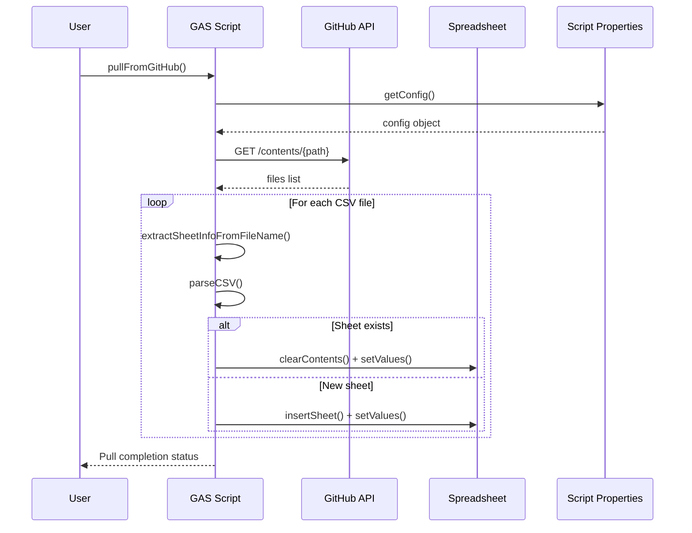
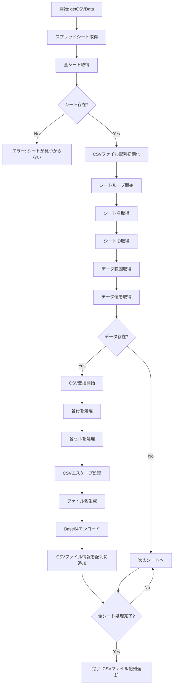
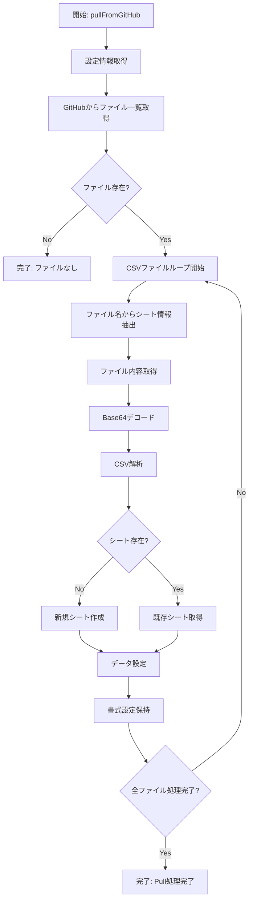
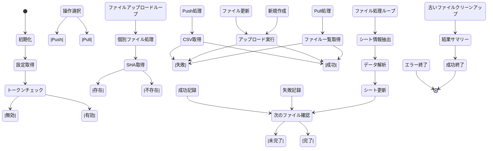
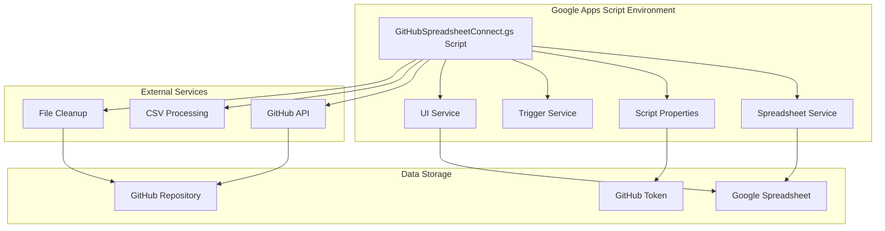

# GitHubSpreadsheetConnect.gs ファイル分析とUML図

## 概要

このドキュメントは、Google Apps Script (GAS) でスプレッドシートとGitHubリポジトリを双方向同期する `GitHubSpreadsheetConnect.gs` ファイルの分析結果と、必要なUML図をまとめたものです。

## ファイル分析

### 主要機能
- スプレッドシートからCSVデータを取得
- CSVデータをBase64エンコード
- GitHub APIを使用してリポジトリにコミット（Push）
- GitHubからCSVファイルを取得してスプレッドシートに反映（Pull）
- 自動同期のためのトリガー設定
- スプレッドシートの書式設定を保持したPull処理
- UIメニューからの手動実行

### 関数一覧
1. `getCSVData()` - CSVデータ取得・変換
2. `getConfig()` - 設定情報取得
3. `getExistingFileSHA()` - 既存ファイルSHA取得
4. `pushToGitHub()` - メイン同期処理（Push）
5. `pullFromGitHub()` - GitHubからスプレッドシートへの同期処理（Pull）
6. `extractSheetInfoFromFileName()` - ファイル名からシート情報を抽出
7. `parseCSV()` - CSV文字列を2D配列に解析
8. `testGitHubConnection()` - 接続テスト
9. `setupAutoSync()` - 自動同期設定
10. `cleanupOldFiles()` - 古いファイルのクリーンアップ
11. `onOpen()` - スプレッドシート開封時のUIメニュー作成

## UML図

### 1. クラス図

### 2. シーケンス図（Push処理）

### 3. シーケンス図（Pull処理）

### 4. アクティビティ図（CSVデータ処理）

### 5. アクティビティ図（Pull処理）

### 6. 状態図（双方向同期処理）

### 7. コンポーネント図

## データフロー

### 入力データ
- Google Spreadsheet の全シートデータ（Push時）
- GitHubリポジトリのCSVファイル群（Pull時）
- スクリプトプロパティ（GitHub Token、コミッター情報）

### 処理フロー

#### Push処理
1. **データ抽出**: 各シート → 個別CSV形式
2. **ファイル名生成**: シートID + シート名
3. **データ変換**: CSV → Base64エンコード
4. **API通信**: GitHub Contents API（個別ファイル）
5. **クリーンアップ**: 古いファイルの自動削除
6. **結果記録**: 各ファイルの処理結果を記録

#### Pull処理
1. **ファイル一覧取得**: GitHubからCSVファイル一覧
2. **ファイル情報解析**: ファイル名からシート情報を抽出
3. **データ取得**: 各CSVファイルの内容を取得
4. **CSV解析**: CSV文字列を2D配列に変換
5. **シート更新**: 既存シートの更新または新規シート作成
6. **書式保持**: `clearContents()`で書式設定を維持

### 出力データ
- GitHubリポジトリの指定パス内のCSVファイル群
- コミット履歴
- 実行ログ
- 処理結果サマリー
- 更新されたスプレッドシート（Pull時）

## 設定項目

### 必須設定
- `GITHUB_TOKEN`: GitHub Personal Access Token
- `GITHUB_OWNER`: GitHubユーザー名または組織名
- `GITHUB_REPO`: リポジトリ名
- `GITHUB_PATH`: 出力フォルダパス

### オプション設定
- `COMMITTER_NAME`: コミッター名
- `COMMITTER_EMAIL`: コミッターメール

## エラーハンドリング

### 主要エラーケース
1. シートが見つからない
2. GitHubトークンが設定されていない
3. GitHub API通信エラー
4. 個別ファイルのアップロード失敗
5. 古いファイルの削除失敗
6. CSV解析エラー
7. シート作成・更新エラー

### エラー対応
- 個別ファイルの処理失敗時も他のファイルは継続処理
- 適切なエラーメッセージの表示
- ログ出力とエラー記録
- 結果サマリーでの成功/失敗件数の報告
- Pull処理時の書式設定保持

## セキュリティ考慮事項

### 認証
- GitHub Personal Access Token の使用
- スクリプトプロパティでの機密情報管理

### アクセス制御
- リポジトリへの読み書き権限
- トークンの有効期限管理
- ファイル削除時の権限確認

## パフォーマンス最適化

### 実行頻度
- デフォルト: 1時間ごと（Pushのみ）
- カスタマイズ可能（分、時間、日単位）
- Pull処理は手動実行のみ

### データ処理
- 効率的なCSV変換
- Base64エンコードの最適化
- 個別ファイル処理による並列性
- 書式設定保持による処理効率化

## 拡張性

### 追加可能な機能
- 複数フォルダへの出力
- 差分更新の最適化
- バックアップ機能
- 通知機能（Slack、メール等）
- データ検証機能
- 双方向同期の自動化

### カスタマイズポイント
- 同期頻度
- 出力フォルダ構造
- コミットメッセージ形式
- エラー通知方法
- ファイル命名規則
- Pull処理の自動化

## 保守性

### コード品質
- 関数の単一責任原則
- エラーハンドリングの統一
- ログ出力の標準化
- 設定の外部化
- 双方向同期の明確な分離

### テスト可能性
- 個別関数の単体テスト
- モック化可能な設計
- エラーケースの網羅
- ログ出力の検証
- Push/Pull処理の個別テスト

## 新機能の特徴

### Pull機能
- **書式保持**: `clearContents()`を使用してスプレッドシートの書式設定を維持
- **ファイル名解析**: `{シートID}_{シート名}.csv`形式のファイル名からシート情報を抽出
- **CSV解析**: 引用符、カンマ、改行を含む複雑なCSVデータを正確に解析
- **新規シート作成**: GitHubに存在するがスプレッドシートに存在しないシートを自動作成

### UI機能
- **カスタムメニュー**: スプレッドシートに「GitHub連携」メニューを追加
- **手動実行**: Push/Pull処理をUIから簡単に実行可能
- **ユーザビリティ**: 技術的な知識がなくても操作可能

### 自動化
- **トリガー管理**: 既存トリガーの自動削除と新規トリガーの作成
- **関数分離**: Push/Pull処理を個別の関数として分離
- **エラー処理**: 個別ファイルの処理失敗時も全体の処理を継続
